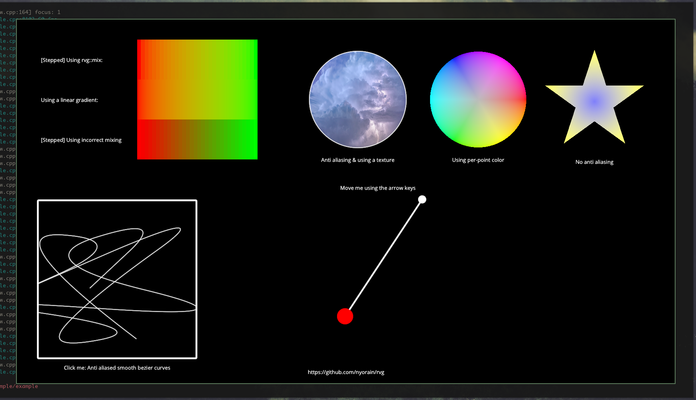

# Retained vulkan/vector graphics

Vulkan library for high-level 2D vector-like rendering.
Modeled loosely after svg, inspired by nanoVG.
Uses an object-oriented, retained mode idiom for rendering which makes it
highly efficient for rendering with vulkan since curves and shapes are not
recomputed and uploaded every frame but just once (or when changed).
Does not even need a command buffer rerecord every frame,
even things like paints, shapes or transforms can be
changed without triggering the need for a command buffer rerecord which makes
it use way less cpu performance than immediate mode alternatives.
Aims to provide a compromise between high level drawing functionality
and an api that can efficiently be implemented on the gpu.
Could e.g. easily be used for a vulkan gui library.

Written in C++17, the project is tagged as C by github because it embeds
[nuklears](https://github.com/vurtun/nuklear) font handling and
some [stb headers](https://github.com/nothings/stb).
Note that the project is still in a rather early stage, please report
all issues and questions coming up (simple things such as spelling errors
or missing docs on a function are appreciated as well).

For more information check out the example concepts below, the
[example](example/example_ny.cpp) showing off many features,
or read the [introduction](docs/intro.md) which documents some basic
concepts and shows how to integrate rvg in more detail.

# Example

Since rvg uses a retained mode you will first have to create the resources
you might to use/draw and then actually draw them (via recording into
a command buffer).
The example below shows initialization of some basic rvg resources (on
the highest abstraction level), there are more and more advanced settings,
refer to the inline documentation in the [headers](include/rvg):

```cpp
init(vpp::Device& dev, vk::RenderPass renderPass) {
	// First create a rvg context: creates pipelines and such
	// We have to specify the renderPass and subpass we want to use it
	// (There are much more settings like pipelineCache/anti aliasing or
	// enabled features, see rvg/context.hpp).
	rvg::Context context {dev, {renderPass, 0u}};

	// Now we can create resources
	// rectangle at {100, 100} with size {200, 200}
	// the last parameter is the draw mode: in this case we want to
	// build fill data but will never stroke it
	auto rect = rvg::RectShape(ctx, {100, 100}, {200, 200}, {true, 0.f});

	// a circle at {300, 300} with radius 10 that we can
	// stroke (with thickness 3.f) and fill
	auto circle = rvg::CircleShape(ctx, {300, 300}, 10, {true, 3.f});

	// a scissor that only render into the given rect (at {50, 50} with size
	// {100, 100})
	auto scissor = rvg::Scissor(ctx, {{50, 50}, {100, 100}});

	// a transform that transforms coordinates from the space we just used
	// (which may e.g. be level or window coordinates) to normalized
	// vulkan coords ([-1, 1] x [-1, 1])
	auto transform = rvg::Transform(ctx, <transform matrix>);

	// a paint that will specify how shapes are filled/stroked
	auto colorPaint1 = rvg::Paint(ctx, rvg::colorPaint(rvg::Color::red));
	auto colorPaint2 = rvg::Paint(ctx, rvg::colorPaint({255u, 128u, 190u}));

	// rvg does also support gradients and texture paints
	// linear gradient from ({100, 100}: red) to ({200, 200}: green)
	auto gradient = rvg::Paint(ctx, rvg::linearGradient(
		{100, 100}, {200, 200},
		rvg::Color::red, rvg::Color::green));

	// create a FontAtlas and load a font
	// rvg uses the font handling from nuklear (using stb truetype & rectpack)
	rvg::FontAtlas fontAtlas(ctx);
	rvg::Font font(fontAtlas, "OpenSans.ttf");
	fontAtlas.bake();

	// using the font we can now create a text object at {400, 100}
	// we could also align it using the metrics information by Font and Text
	rvg::Text text(ctx, "Text to display", font, {400, 100});
}
```

After having all these resources created we naturally want to render them.
Since rvg tries to stay as modular and univerally usable as possible,
the interface all resources use for rendering is a raw vulkan command buffer.
Binding state (like transform/paint/scissor) will result in a simple
descriptor set bind while rendering shapes will result always in an indirect
draw.
Assuming the resources from above, this could look like this:

```cpp
render(vk::CommandBuffer cb) {
	// Binds default (full) scissor, identity transform and other required
	// state
	ctx.bindDefaults(cb);

	// We can bind state and draw what we want now.
	// Bound state stays the same until replaced
	// First, we bind our transform
	transform.bind(cb);

	// Now, let's draw!
	// Starting with the rect shape: we specified that we might want
	// to fill it but don't need the stroke data. So now we can record
	// its fill commands but were not allowed to stroke it
	paint1.bind(cb);
	rect.fill(cb);

	circle.fill(cb);

	paint2.bind(cb);
	circleShape.stroke(cb);

	// we can also fill/stroke shapes multiple times
	scissor.bind(cb);
	rect.fill(cb);

	// explicitly reset the limiting scissor bound above:
	ctx.defaultScissor().bind(cb);

	gradient.bind(cb);
	text.draw(cb);
}
```

It's now probably pretty easy to imagine how you could use rvg to further
build your own (roughly) object-oriented interfaces and divide the work
into small components.

## Screenshots

Screenshot of [example/example.cpp](example/example.cpp):



## Building

The library uses meson as build system. It uses a few of my other
libraries as dependencies to stay modular.
You need a solid C++17 compiler (currently not tested with msvc),
gcc >= 7 is tested.

After building

```
meson build -Dexamples=true
ninja -C build
```

you should be able to run the example in the build dir via `./example/example`

# Notes

Please read the linked introduction (requirements) before reporting build issues.
Contributions welcome, always want to hear ideas and suggestions.

This library is the successor of/inspired my attempt to write a
[nanoVG vulkan backend](https://github.com/nyorain/vvg), which worked
but didn't really make use of vulkans advantages. That inspired
me to look into which kind of abstraction would make sense for vulkan.
